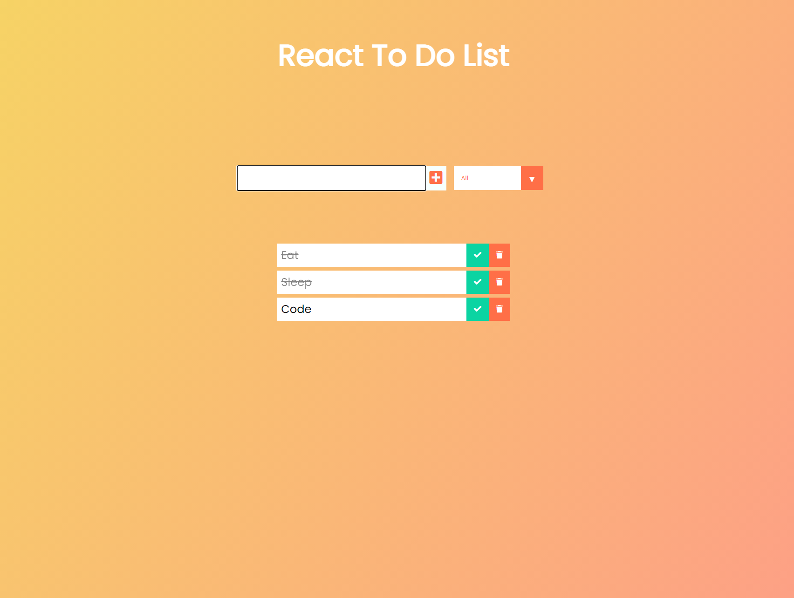

# React Todo List 

## Overview
Make,delete,filter todos. 

## Table of Contents
- [Overview](#Overview)
- [Description](#Description)
- [Installation](#Installation)
- [Usage](#Usage)
- [Safe Travels! Screenshots](#Screenshots)
- [Built With](#Built)
- [Heroku](#Heroku)
- [License](#License)
- [Contributors](#Contributors)
- [GitHub](#GitHub) 

## Description
Todo app made with react.

## Installation
    `npm install`

## Usage
To run app locally:

    `npm start`

Once 'App listening on PORT: 3000' displays in your terminal, open your browser and search:

    `http://localhost:3000/`

## License

[MIT License](http://opensource.org/licenses/mit-license.php)

## Contributors
* **Dan Chiev** - React.js, MongoDB/Mongoose, Bcryptjs, JavaScript

## Github Info
[Dan Chiev](https://github.com/dchiev),

